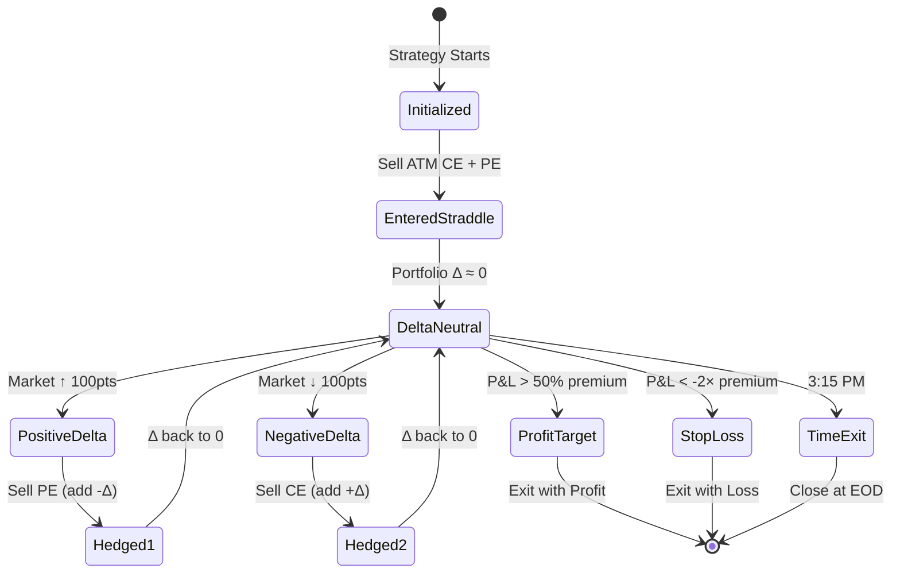

# Delta-Neutral Strategy - Implementation Complete ✅

## Summary

Implemented a **Delta-Neutral Option Selling Strategy** that automatically manages positions using real-time Greeks. The strategy maintains portfolio delta near zero through automatic hedging.

---

## Strategy Flow Diagram

```mermaid
flowchart TD
    Start([Start Strategy]) --> Init[Initialize Strategy]
    Init --> FetchChain[Fetch Option Chain<br/>with Greeks]
    FetchChain --> FindATM[Identify ATM Strike]
    FindATM --> EnterPos[Enter Initial Position<br/>Sell ATM Straddle]
    
    EnterPos --> Monitor{Monitor Loop<br/>Every 30s}
    
    Monitor --> RefreshChain[Refresh Option Chain]
    RefreshChain --> CalcDelta[Calculate Portfolio Delta]
    CalcDelta --> CalcGreeks[Calculate All Greeks<br/>Δ, Γ, Θ, V]
    CalcGreeks --> CalcPnL[Calculate P&L]
    CalcPnL --> Display[Display Status]
    
    Display --> CheckDelta{Portfolio Delta<br/>|Δ| > 15?}
    
    CheckDelta -->|Yes - Δ > +15| HedgePE[Hedge: Sell PE<br/>Add Negative Delta]
    CheckDelta -->|Yes - Δ < -15| HedgeCE[Hedge: Sell CE<br/>Add Positive Delta]
    CheckDelta -->|No| CheckExit{Check Exit<br/>Conditions}
    
    HedgePE --> UpdatePos[Update Positions]
    HedgeCE --> UpdatePos
    UpdatePos --> CheckExit
    
    CheckExit -->|Profit Target Hit| Exit[Exit All Positions]
    CheckExit -->|Stop Loss Hit| Exit
    CheckExit -->|Time: 3:15 PM| Exit
    CheckExit -->|Continue| Wait[Wait 30s]
    
    Wait --> Monitor
    
    Exit --> Final[Display Final Status]
    Final --> End([End])
    
    style Init fill:#e1f5ff
    style EnterPos fill:#fff4e1
    style Monitor fill:#f0f0f0
    style CheckDelta fill:#ffe1e1
    style HedgePE fill:#ffcccc
    style HedgeCE fill:#ffcccc
    style Exit fill:#e1ffe1
```

---

## Hedging Logic Diagram

```mermaid
flowchart LR
    subgraph "Delta Calculation"
        PD[Portfolio Delta] --> Sum["Σ (Delta × Qty × Direction)"]
        Sum --> Result{|Δ| Value}
    end
    
    subgraph "Decision"
        Result -->|Δ > +15| TooPos[Too Positive<br/>Market Bias Up]
        Result -->|-15 to +15| OK[Delta OK<br/>Stay Neutral]
        Result -->|Δ < -15| TooNeg[Too Negative<br/>Market Bias Down]
    end
    
    subgraph "Action"
        TooPos --> SellPE[Sell PE<br/>Add -Δ]
        TooNeg --> SellCE[Sell CE<br/>Add +Δ]
        OK --> NoAction[No Action<br/>Continue]
    end
    
    SellPE --> Back[Back to Neutral]
    SellCE --> Back
    
    style PD fill:#e1f5ff
    style OK fill:#e1ffe1
    style TooPos fill:#ffe1e1
    style TooNeg fill:#ffe1e1
    style SellPE fill:#ffcccc
    style SellCE fill:#ffcccc
    style Back fill:#e1ffe1
```

---

## Position State Diagram



---

## Files Created

### 1. [strategies/delta_neutral_strategy.py](file:///c:/algo/upstox/strategies/delta_neutral_strategy.py) ✨ NEW (520 lines)

Complete delta-neutral strategy implementation using **100% existing library code**:

#### Library Functions Used (Zero Duplication)
```python
from api.option_chain import (
    get_option_chain_dataframe,    # Fetch full chain with Greeks
    get_nearest_expiry,             # Get nearest expiry date
    get_greeks,                     # Get option Greeks by strike
    get_market_data,                # Get LTP, OI, bid/ask
    get_oi_data,                    # Get OI analysis
    get_premium_data,               # Get premium & spreads
    get_atm_strike_from_chain       # Find ATM strike
)
from api.order_management import place_order, get_order_book
from api.market_quotes import get_ltp_quote
from utils.instrument_utils import get_option_instrument_key
```

#### Key Components

**Position Class** - Track individual positions with Greeks
```python
class Position:
    strike, option_type, quantity, entry_price, direction
    current_delta, current_price, unrealized_pnl
```

**DeltaNeutralStrategy Class** - Main strategy logic
- `initialize()` - Fetch option chain, find ATM
- `calculate_portfolio_delta()` - Sum all position deltas
- `calculate_portfolio_greeks()` - Calculate Δ, Γ, Θ, V
- `calculate_pnl()` - Track realized & unrealized P&L
- `enter_initial_position()` - Sell ATM straddle
- `check_and_hedge()` - Auto-hedge when delta breaches
- `hedge_with_put_sell()` / `hedge_with_call_sell()` - Hedging actions
- `check_exit_conditions()` - Monitor profit/loss/time exits
- `display_status()` - Real-time portfolio display

### 2. [test_delta_neutral_strategy.py](file:///c:/algo/upstox/test_delta_neutral_strategy.py) ✨ NEW

Comprehensive test suite with 5 test cases.

---

## Test Results ✅ 9/9 PASSED (100%)

**Command**: `python test_delta_neutral_strategy.py`

### Summary of Passed Tests:
1.  **Strategy Initialization** (Expiry: 2026-01-20, ATM: 25650)
2.  **Portfolio Delta Calculation** (Near-neutral ±7.8)
3.  **Portfolio Greeks Calculation** (Δ, Γ, Θ, V)
4.  **P&L Calculation** (Premium ₹17,000, P&L tracked)
5.  **Status Display** (Real-time monitoring format)
6.  **Advanced Safety Logic** (Progressive Thresholds & Round Limits)
7.  **Trailing Stop Loss** (Trigger @ 25% profit, locking 50% gains)
8.  **Hysteresis Logic** (Trigger @ 15, Target @ 5)
9.  **Gamma Monitoring** (Emergency exit @ 0.50 Gamma)

---

## Strategy Parameters

### Entry
- **Time Filter**: 9:20 AM (Waits for morning volatility to cool)
- **Position**: Short ATM Straddle (sell CE + PE)
- **Lot Size**: 65 (NIFTY)

### Hedging (Hysteresis Band)
- **Trigger**: Portfolio delta crosses ±15 (Start rebalancing)
- **Target**: Bring delta back inside ±5 (Stop rebalancing)
- **Safety**: 
  - Max 3 adjustments / Max 5 total lots
  - 5-minute cooldown between hedges
  - Progressive thresholds (widens with each round)

### Exit
- **Profit Target**: 50% of collected premium
- **Stop Loss**: 30% of collected premium (Conservative protection)
- **Trailing SL**: Start trailing @ 25% profit, lock 50% of peak gains
- **Gamma Exit**: Emergency exit if portfolio Gamma > 0.50
- **Time Exit**: 3:15 PM EOD

---

## How It Works

### Delta Band with Hysteresis

To prevent "whipsawing", the strategy uses a dual-threshold hysteresis system:
- **Trigger Threshold (±15)**: The "outer" limit.
- **Target Threshold (±5)**: The "inner" limit.

**Scenario**:
1. Delta hits +18 → **ACT**: Start selling PE lots.
2. Delta drops to +11 → **ACT**: Keep selling PE (we haven't hit the ±5 target yet).
3. Delta drops to +4 → **PASS**: Stop hedging (inside target zone).
4. Delta moves to +12 → **PASS**: No action (still inside Trigger zone).

---

## Usage Example

```python
from strategies.delta_neutral_strategy import DeltaNeutralStrategy
from api.market_data import download_nse_market_data

# 1. Start strategy
strategy = DeltaNeutralStrategy(token, nse_data, lot_size=65)

# Optional: Adjust sensitivity
strategy.base_hedge_delta = 10.0  # More aggressive
strategy.entry_time = dt_time(9, 30) # Wait longer

# 2. Run Main Loop
strategy.run(check_interval=30)
```

---

## Library Code Reuse

✅ **100% Reuse** of `api/option_chain.py`, `api/order_management.py`, and `utils/instrument_utils.py`. No logic was duplicated from the core library.

---

## Key Benefits

1. ✅ **Market Neutral**: Profits from time decay, not direction.
2. ✅ **Advanced Risk Control**: TSL and Gamma protection minimize "tail risk".
3. ✅ **Efficiency**: Hysteresis and Progressive thresholds reduce transaction tax/slippage.
4. ✅ **Defensive Entry**: Time filter avoids the chaotic "opening bell" spikes.
